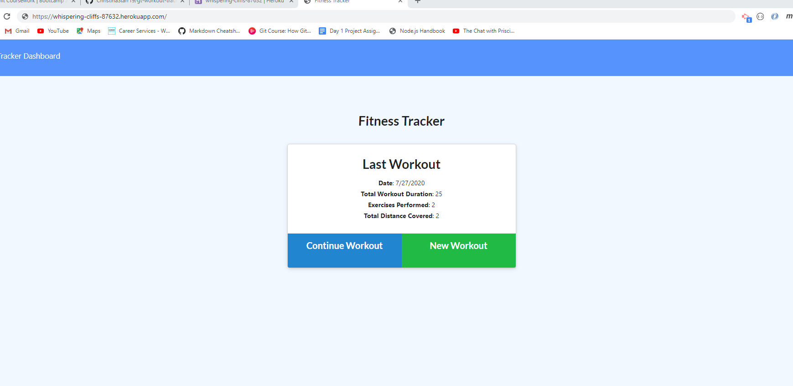

# Workout Tracker using MongoDb through Mongoose

## Table of Contents 

* [Installation](#installation)
* [Usage](#usage)
* [Credits](#credits)
* [MIT_License](#mit_license)

## Installation

1. Clone the repo, 
2. In the repo, run npm install and,
3. Run the server.js file in your terminal using 'node server.js'.
4. To see the deployed site, click on the deployed link under Usage.

## Usage 

This Workout tracker is designed to create a new workout and add to an existing workout. Information is sent from the client to MongoDB using Express servers and Mongoose. Organizing your own home workout regimen is easier when the tracker does all the work. It was also designed to meet the criteria for GT Full-stack Flex program homework requirements. 

[Deployed Site on Heroku](https://whispering-cliffs-87632.herokuapp.com/)

## Credits

This was a solo project completed as homework for the Georgia Tech, FullStack Flex program. However, I recieved insight on how to execute virtuals from my TA, Peter Colella. Fellow collegues like Brian Warner and Gregory Monroe contributed insight towards creating the code.

## MIT_License

Copyright (c) [2020] [Christina Cunningham Starr]

Permission is hereby granted, free of charge, to any person obtaining a copy
of this software and associated documentation files (the "Software"), to deal
in the Software without restriction, including without limitation the rights
to use, copy, modify, merge, publish, distribute, sublicense, and/or sell
copies of the Software, and to permit persons to whom the Software is
furnished to do so, subject to the following conditions:

The above copyright notice and this permission notice shall be included in all
copies or substantial portions of the Software.

THE SOFTWARE IS PROVIDED "AS IS", WITHOUT WARRANTY OF ANY KIND, EXPRESS OR
IMPLIED, INCLUDING BUT NOT LIMITED TO THE WARRANTIES OF MERCHANTABILITY,
FITNESS FOR A PARTICULAR PURPOSE AND NONINFRINGEMENT. IN NO EVENT SHALL THE
AUTHORS OR COPYRIGHT HOLDERS BE LIABLE FOR ANY CLAIM, DAMAGES OR OTHER
LIABILITY, WHETHER IN AN ACTION OF CONTRACT, TORT OR OTHERWISE, ARISING FROM,
OUT OF OR IN CONNECTION WITH THE SOFTWARE OR THE USE OR OTHER DEALINGS IN THE
SOFTWARE.
